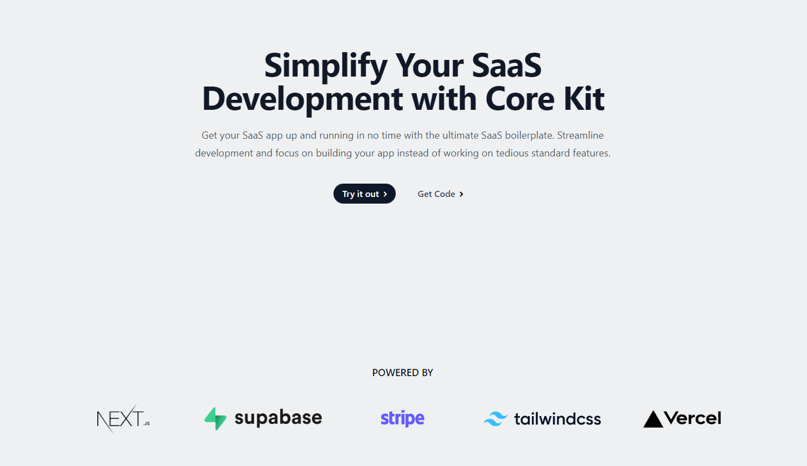
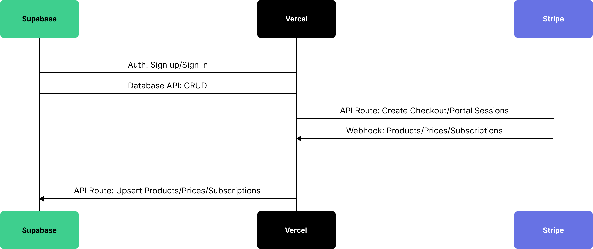

# Core Kit SaaS boilerplate

Get your SaaS app up and running in no time with the ultimate SaaS boilerplate. Streamline development and focus on building your app instead of working on tedious standard features.

## Features

- **Subscription Payments** - Charge your customers on a recurring basis for your services or products.
- **Next.js & Tailwind UI** - Create lightning-fast web applications with ease by combining the power of the [Next.js](https://nextjs.org/) framework with the customizable components of [Tailwind UI](https://tailwindcss.com/).
- **Pre-built Components** - Speed up your development process by accessing pre-built components.
- **Supabase Database** - Use Supabase Database to create a high-performance backend that can handle large amounts of data.
- **Authentication & Authorization** - Implement secure access controls on your website with [Supabase](https://supabase.com/docs/guides/auth/overview), so only authorized users can access certain areas or features.
- **Automatic syncing** - Automatically sync pricing plans and subscription statuses via [Stripe webhooks](https://stripe.com/docs/webhooks)
- **Social Logins** - Make sign-up easy for your users by allowing them to use their social media accounts to register for your website.
- **Email Notifications** - Keep your users in the loop by sending them email notifications about important updates or events.

## Demo

- https://subscription-payments.vercel.app/

## Architecture

## Setup

Learn how to setup Core Kit in [Setup](Setup.md)